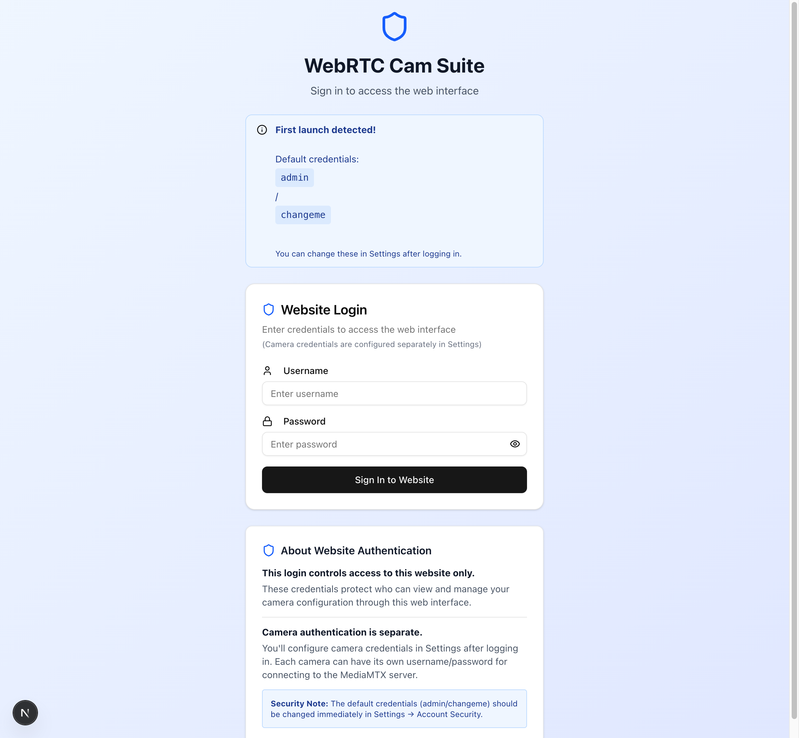
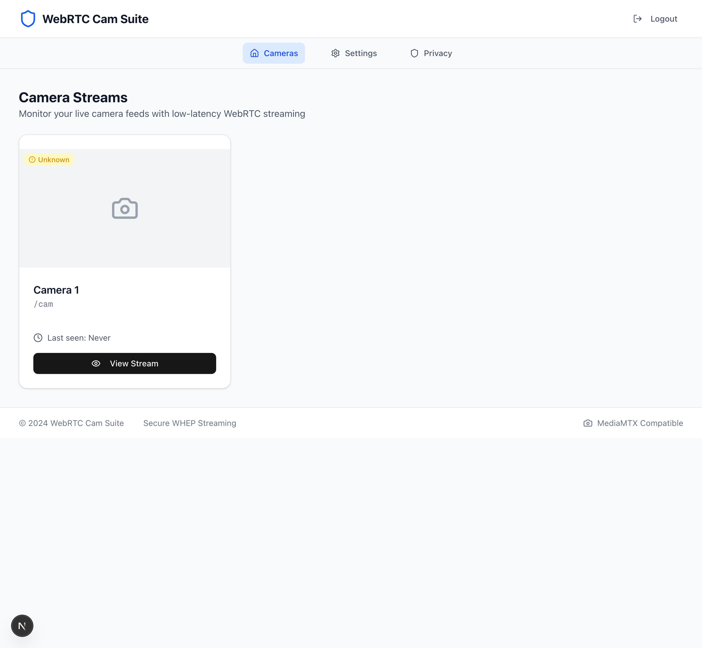
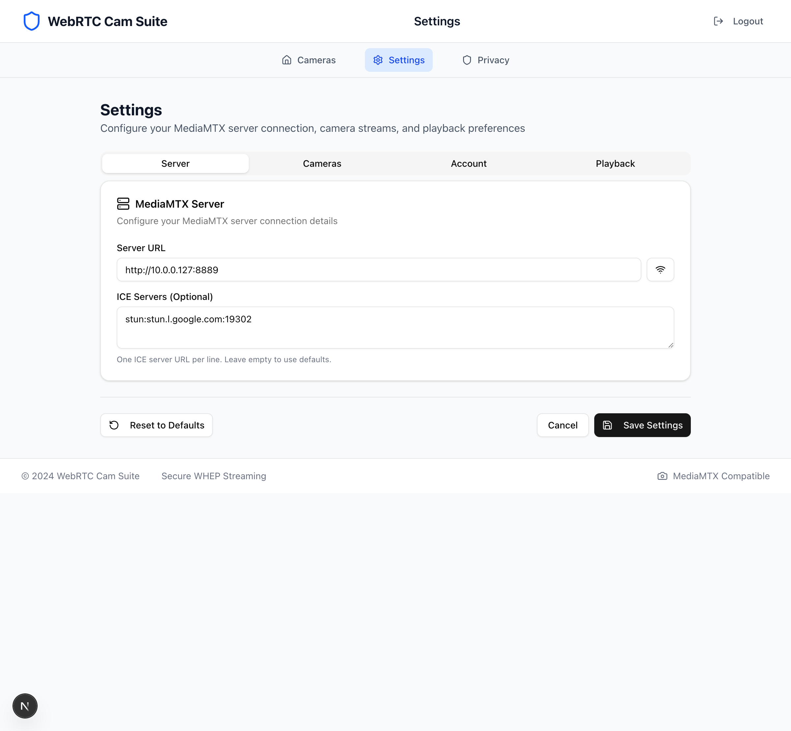
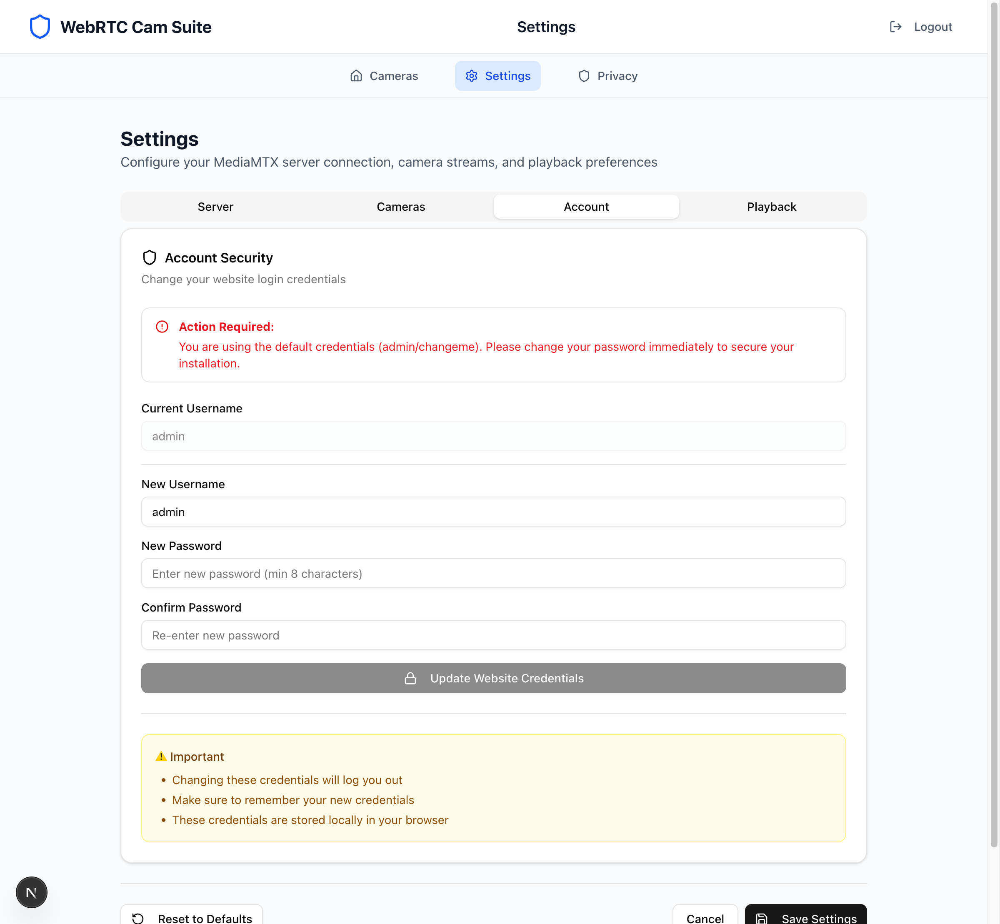

# WebRTC Camera Suite

A complete camera streaming system combining Raspberry Pi streaming server with a modern web viewer. Features ultra-low latency WebRTC streaming, mobile-optimized interface, and easy setup scripts. Perfect for home security, business monitoring, pet cams, and more.


## 🏗️ Project Structure

```
webrtc-camera-suite/
├── rpi-config/          # MediaMTX configs, service files, Pi setup scripts
│   ├── mediamtx.yml     # MediaMTX server configuration
│   ├── install.sh       # Raspberry Pi installation script
│   ├── update.sh        # MediaMTX update script
│   └── README.md        # Pi setup instructions
├── webapp/              # Next.js viewer/configurator
│   ├── src/
│   │   ├── app/         # Next.js app router pages
│   │   ├── components/  # React components
│   │   ├── lib/         # Utilities and services
│   │   └── types/       # TypeScript definitions
│   ├── package.json
│   └── ...
├── docs/                # Setup guides, architecture notes
│   ├── SETUP.md         # Complete setup guide
│   ├── ARCHITECTURE.md  # System architecture
│   └── API.md           # MediaMTX API reference
└── README.md            # This file
```

## 📸 Screenshots

<div align="center">

### Login & Authentication


*Secure login page with dual authentication system (site + camera credentials)*

### Camera Grid


*Modern camera grid interface with status indicators and quick access*

### Settings - Server Configuration


*Easy server configuration with MediaMTX and ICE server setup*

### Settings - Account Security


*Account management with security warnings for default credentials*

</div>

## 🚀 Features

- **🔐 Secure Authentication**: HTTP Basic Auth with configurable credential storage
- **📱 Mobile-First Design**: Touch-friendly controls optimized for phones and tablets
- **⚡ Ultra-Low Latency**: WebRTC WHEP protocol for real-time video (< 500ms)
- **📊 Stream Statistics**: Live bitrate, latency, FPS, and packet loss monitoring
- **🔄 Auto-Reconnection**: Intelligent reconnection with exponential backoff
- **🎛️ Advanced Controls**: Play/pause, mute, fullscreen, picture-in-picture
- **⌨️ Keyboard Shortcuts**: Desktop shortcuts for camera switching and controls
- **🎨 Modern UI**: Clean, intuitive interface for any monitoring use case
- **🏠 Self-Hosted**: Complete privacy with local-only streaming
- **🔧 Easy Setup**: Automated Raspberry Pi installation scripts

## 📋 System Requirements

### Raspberry Pi Server
- **Hardware**: Raspberry Pi 3B+ or newer (Pi 4B 4GB+ recommended)
- **Storage**: 16GB+ microSD card (Class 10 or better)
- **Network**: Ethernet connection preferred
- **Cameras**: RTSP-compatible IP cameras

### Viewing Devices
- **Browser**: Chrome 88+, Firefox 85+, Safari 14+, Edge 88+
- **Network**: Same LAN as Raspberry Pi (or VPN for remote access)

## 🚀 Quick Start

### 1. Set Up Raspberry Pi

1. **Flash Raspberry Pi OS** to microSD card
2. **Copy installation files** to your Pi:
   ```bash
   scp -r rpi-config/ pi@your-pi-ip:~/camera-suite/
   ```
3. **Run the installation script**:
   ```bash
   ssh pi@your-pi-ip
   cd ~/camera-suite/rpi-config
   ./install.sh
   ```

### 2. Configure Cameras

1. **Update camera IPs** in `/etc/mediamtx/mediamtx.yml`
2. **Restart the service**:
   ```bash
   sudo systemctl restart mediamtx
   ```

### 3. Set Up Web Viewer

1. **Install dependencies**:
   ```bash
   cd webapp
   npm install
   ```

2. **Configure environment**:
   ```bash
   cp .env.example .env.local
   # Edit .env.local with your Pi's IP address
   ```

3. **Start the application**:
   ```bash
   npm run dev
   ```

4. **Access at** http://localhost:3000

## 📚 Documentation

- **[Complete Setup Guide](docs/SETUP.md)** - Step-by-step installation and configuration
- **[System Architecture](docs/ARCHITECTURE.md)** - Technical details and design decisions  
- **[API Reference](docs/API.md)** - MediaMTX API endpoints and usage examples
- **[Raspberry Pi Setup](rpi-config/README.md)** - Pi-specific setup and troubleshooting
- **[Web App Quick Start](webapp/QUICK_START.md)** - First-time setup and authentication guide
- **[Security Notes](webapp/SECURITY_NOTES.md)** - Security implementation details
- **[Test Suite](webapp/tests/README.md)** - E2E testing documentation

## 🎯 Default Configuration

After installation, your system will have:

- **MediaMTX Server**: Running on Pi at port 8889 (WebRTC)
- **Default Credentials**: `admin` / `changeme` (change immediately!)
- **Camera Paths**: `/camera1`, `/camera2`, `/camera3` (configurable)
- **Web Interface**: Accessible via Pi's IP or localhost:3000

## 🔒 Security Features

- **HTTP Basic Authentication** for all stream access
- **Local Network Only** - no external dependencies
- **Credential Storage Options** - session-only or persistent
- **DTLS Encryption** for WebRTC streams
- **Firewall Configuration** included in setup
- **System User Isolation** for MediaMTX service

## 🛠️ Management Commands

### Raspberry Pi Service
```bash
# Service management
sudo systemctl start|stop|restart mediamtx
sudo systemctl status mediamtx

# View logs
sudo journalctl -u mediamtx -f

# Update MediaMTX
cd ~/camera-suite/rpi-config
./update.sh
```

### Web Application
```bash
# Development
cd webapp
npm run dev

# Production build
npm run build
npm start

# Type checking
npm run type-check
```

## 🐛 Troubleshooting

### Common Issues

1. **Camera not connecting**: Verify RTSP URL and credentials
2. **WebRTC fails**: Check firewall and browser support
3. **High latency**: Use wired connections, reduce camera bitrate
4. **Service won't start**: Check logs with `sudo journalctl -u mediamtx`

### Health Checks
```bash
# Test MediaMTX API
curl http://pi-ip:9997/v3/config/get

# Test camera stream  
curl -u admin:changeme http://pi-ip:8889/camera1/

# Check system resources
htop
```

## 🔧 Customization

### Adding Cameras
1. Update `/etc/mediamtx/mediamtx.yml` with new camera paths
2. Restart MediaMTX service
3. Add camera names to webapp environment config

### Changing Credentials
1. Edit `readUser`/`readPass` in MediaMTX config
2. Update webapp login credentials
3. Restart services

### Mobile App Deployment
Build and deploy the webapp to:
- **Vercel/Netlify** for cloud hosting
- **Local server** on the Raspberry Pi
- **Docker container** for easy deployment

## 📱 Mobile Experience

The web interface is fully optimized for mobile:

- **Touch Controls**: Large, finger-friendly buttons
- **Responsive Layout**: Adapts to any screen size  
- **Swipe Navigation**: Gesture-based camera switching
- **Wake Lock**: Keeps screen on during viewing
- **Offline Support**: Works without internet connection

## 🤝 Contributing

1. Fork the repository
2. Create a feature branch
3. Test on actual hardware (Pi + cameras)
4. Submit a pull request

### Development Setup
1. Set up a Raspberry Pi with cameras for testing
2. Run webapp in development mode
3. Test WebRTC streaming end-to-end
4. Verify mobile responsiveness

## 📄 License

This project is licensed under the MIT License - see the [LICENSE](LICENSE) file for details.

## 🙏 Acknowledgments

- **[MediaMTX](https://github.com/bluenviron/mediamtx)** - Excellent Go-based streaming server
- **[Next.js](https://nextjs.org/)** - React framework for the web interface
- **[Shadcn/ui](https://ui.shadcn.com/)** - Beautiful component library
- **[Tailwind CSS](https://tailwindcss.com/)** - Utility-first CSS framework

---

**Ready to set up your camera monitoring system? 📹🔒**

Perfect for:
- 🏠 Home security monitoring
- 👶 Baby/nursery monitoring  
- 🐕 Pet monitoring
- 🏢 Business/office surveillance
- 🚗 Garage/driveway monitoring

Get started with the [Complete Setup Guide](docs/SETUP.md) or jump to [Raspberry Pi Configuration](rpi-config/README.md)!